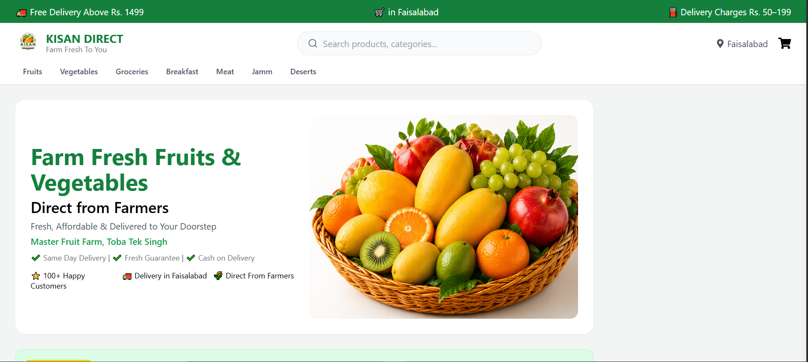
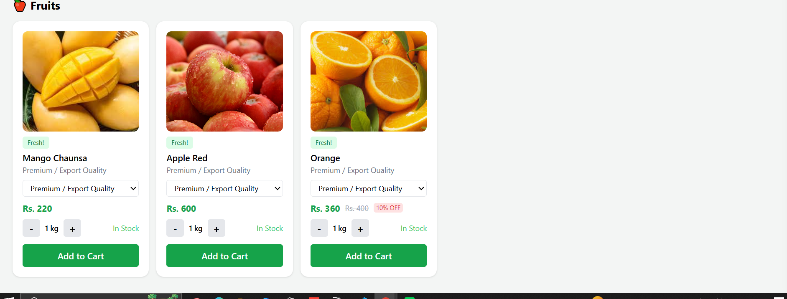
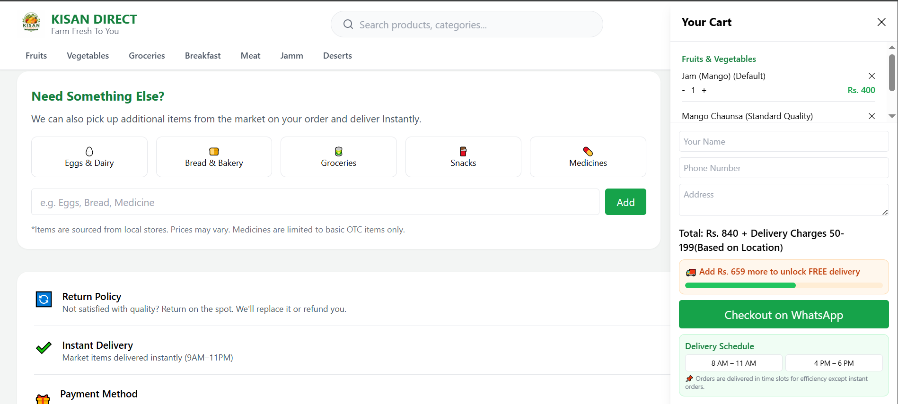
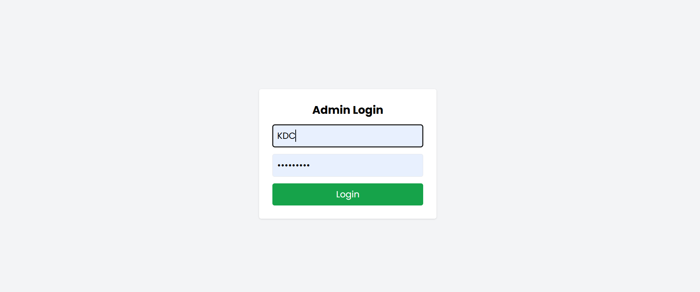
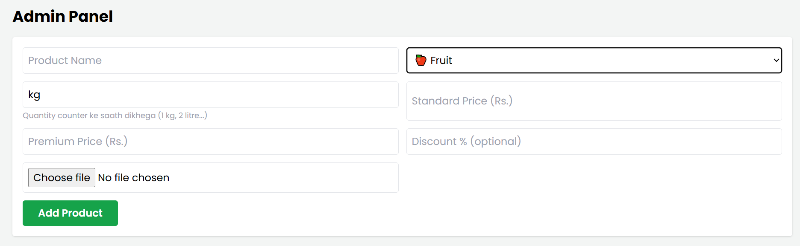
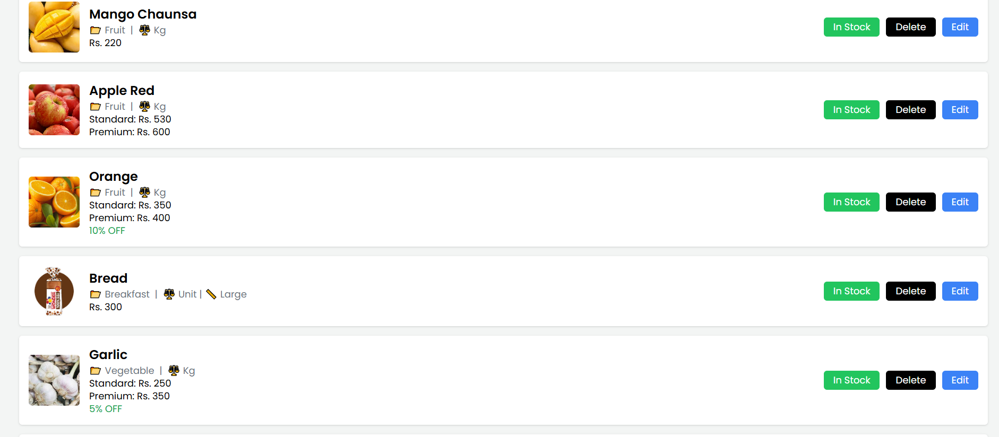

# 🌾 Kisan Direct

Kisan Direct is a full-stack MERN marketplace web application designed to connect users with fresh farm products, groceries, and homemade items directly from sellers.

## 🚀 Features

- ⚙️ Dynamic Control
- 💻 Custom Catogery Add
- 🛒 Product listing system
- 🔍 Category-based products
- 🧺 Shopping cart functionality
- 👨‍💼 Admin panel
- ➕ Add / Edit / Delete products
- 📦 Stock availability toggle
- 🖼 Image upload with Cloudinary
- 💰 Discount support
- 📱 Responsive UI

---

## 🛠 Tech Stack

### Frontend
- React.js
- Vite
- Tailwind CSS
- Axios
- React Router

### Backend
- Node.js
- Express.js
- MongoDB
- Mongoose

---

## 📂 Project Structure

```bash
frontend/
backend/
```

---

## ⚙️ Installation

### Clone Repository

```bash
git clone https://github.com/Ubaid-SE/kisan-direct.git
```

### Install Dependencies

#### Frontend

```bash
cd frontend
npm install
npm run dev
```

#### Backend

```bash
cd backend
npm install
npm start
```

---

## 🔐 Environment Variables

Create `.env` files inside frontend and backend folders.

### Frontend `.env`

```env
VITE_ADMIN_USER=your_username
VITE_ADMIN_PASS=your_password
```

### Backend `.env`

```env
MONGO_URI=your_mongodb_connection
```

---

## 📸 Screenshots

### Home Page


---

### Product Listing


---

### Cart Page


---

### Admin Login


---

### Admin Panel


---

### Admin Dashboard


---

## 🌍 Future Improvements

- JWT Authentication
- Online Payments
- Order Tracking
- Seller Dashboard
- User Profiles

---

## 👨‍💻 Author

Developed by Ubaid
